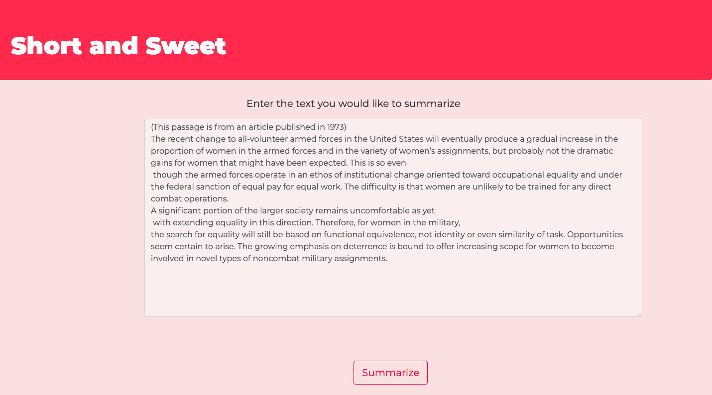
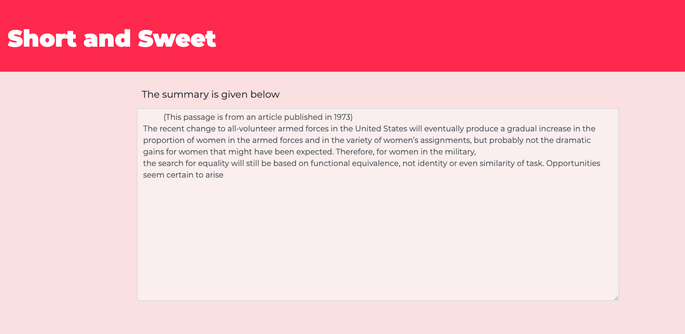

# Short and Sweet

Short and Sweet is an extractive text summarizer which incorporates Google's Word2Vec embeddings and a few linear algebra operations. The summarizer returns a non-repetitive, concise summary of a piece of text. Short and Sweet uses Flask to render the UI. 


## Results

Here is the text before summarization :

 

 

Here is the text after summarization :

 

 

## The neural network
Please look at **NLP.ipynb** for the Neural network model which generates the word embedding templates (not used in final model) and follows the word2vec algorithm.

Our architecture involves a 3 layer neural network. We have decided to construct this purely in numpy. Our inputs are batches of sentences in the corpus after preprocessing. We choose the centre word as our y(i) for an example. The X(i) is the average of the context words for that particular center word. X(i) is the average of C context words before and C context words after the center word where C is the context window size which is 2 in our example.
The neural network uses ReLU functions as activations to introduce non-linearity. Our result is the average of both the weights in our model. The middle layer has N units where N is the dimension of our embeddings.  The final weights after training can be averaged to provide a matrix of size V X N where V is our vocabulary and N is the embedding dimension. The final layer has a softmax to predict one of the V possible words.


## Installations and Downloads

Use the package manager [pip](https://pip.pypa.io/en/stable/) to install the dependencies.

```bash
pip3 install -r requirements.txt
```

This [link](https://drive.google.com/file/d/0B7XkCwpI5KDYNlNUTTlSS21pQmM/edit) contains the **word2vec pre-trained Google News corpus** (3 billion running words) word vector model (3 million 300-dimension English word vectors).

It is mirroring the data from the official word2vec website:
**GoogleNews-vectors-negative300.bin.gz**

Please download this file in the same folder as this project.

## Structure of the project
- The **try.py** file creates a dictionary from the model with words as key and vectors(300,) as values. Then this stores the dictionary using pickle. **Please note this new file consumes about 3.75 GB**.
You can delete the **GoogleNews-vectors-negative300.bin.gz** file after the **dictionary** file is made.

- The **backend.py** file contains the logic behind the summarizer. Please check out this file to understand the algorithm. This also includes all the linear algebra operations.

- The **templates** directory contains the **HTML** files used by the flask server.

- The **static** directory contains the **CSS** files used by the flask server.

- Please look at **NLP.ipynb** for the Neural network model which generates the word embedding templates (not used in final model) and follows the word2vec algorithm (CBOW) .


## Usage


For the **first time only** 
run this in the terminal
```python
python3 try.py
```

Be patient as this may take a while to finish running (up to 10 minutes).
Then run the code below

**The second time onward run only this**
```python
python3 backend.py
```
Allow the model a few minutes (3-4) to load.

Open the browser and type http://localhost:5000/ in the url

The project is up and running! Enjoy and experiment!

## Contributing
Pull requests are welcome. For major changes, please open an issue first to discuss what you would like to change.


## License
[MIT](https://choosealicense.com/licenses/mit/)
